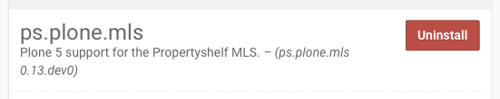

Installation and Configuration
==============================

Install the Plone Embedding Add-On
----------------------------------

You can install the Add-On like any other Plone Add-On: click on your username in the *personal tools menu* and select **Site Setup**.
Next, click the **Add-Ons** item in the *Plone Configuration* section.
You should see an item called **Propertyshelf MLS**.

Change the default MLS Configuration
------------------------------------

Changing the MLS configuration for a particular folder
------------------------------------------------------

Overriding the point of contact
-------------------------------

Overriding the contact information for a particular folder
----------------------------------------------------------
