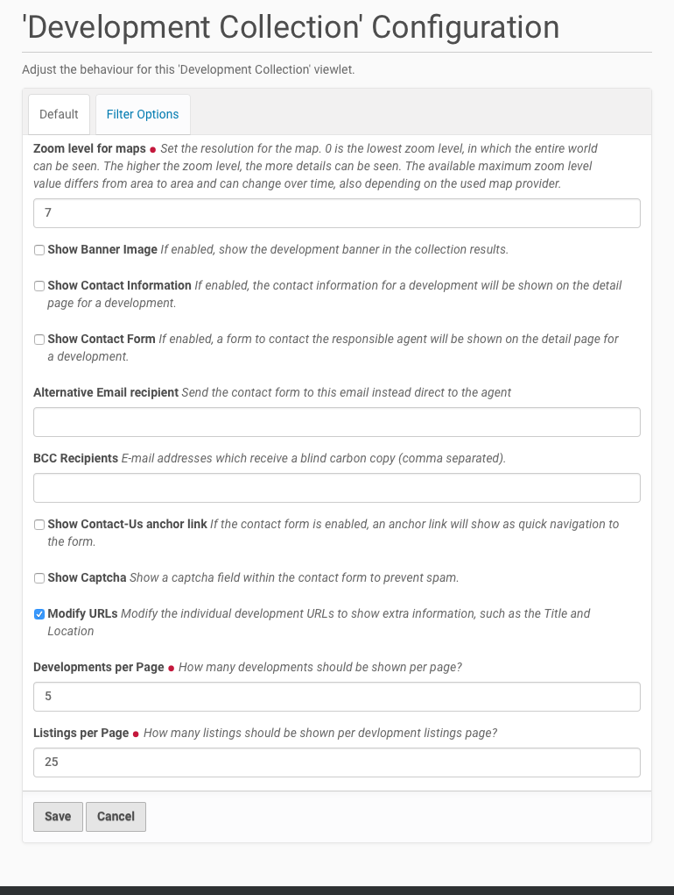
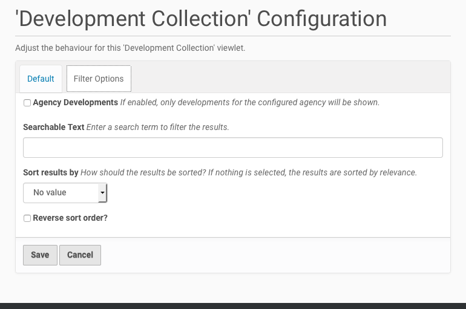

Embedding Development Projects
==============================

Activate a Development Collection
---------------------------------

At first, open the **Actions**-menu and select **Activate Development Collection**:

.. image:: ../_images/activate_development_collection.png

When the **Development Collection** was activated, you will see a status message:

.. image:: ../_images/activate_development_collection_done.png

To configure the **Development Collection** click on the new link **Configure Development Collection**.
The configuration form opens in a nice overlay:

Once all search criterias are entered click the **Save** button.

To de-activate the **Development Collection** again, open the **Actions**-menu and select **Deactivate Development Collection**:

.. image:: ../_images/deactivate_development_collection.png

When the **Development Collection** was deactivated, you will see a status message:

.. image:: ../_images/deactivate_development_collection_done.png

