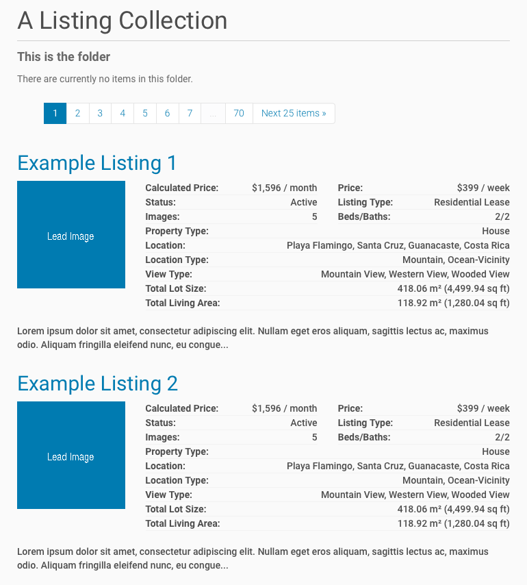
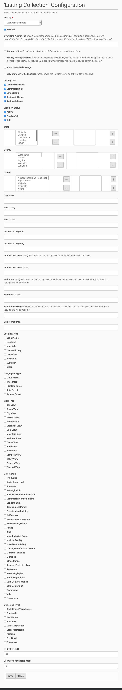

===================
Listing Collections
===================

Working With Listing Collections
================================

Activate a Listing Collection
-----------------------------

To show listings within your site, go to the place in your Plone site where you want to have the listings available and open the **Actions**-menu.
Select **Activate Listing Collection** from the available options:

.. figure:: ../../_images/activate_listing_collection.png

   Activate a listing collection

When the **Listing Collection** was activated, you will see a status message:

.. figure:: ../../_images/activate_listing_collection_done.png

   Confirmation that the listing collection has been activated

This will by default show you all available listings from your connected MLS.

   List of listings after collection has been activated

Deactivate a Listing Collection
-------------------------------

You can disable the embedding of a listing collection at any time.
When you deactivate the embedding, your configuration will not be removed.
So if you later decide to enable the embedding again, you don't have to start from the beginning.

To deactivate the **Listing Collection**, open the **Actions**-menu and select **Deactivate Listing Collection**:

.. figure:: ../../_images/deactivate_listing_collection.png

   Deactivate a listing collection

When the **Listing Collection** was deactivated, you will see a status message:

.. figure:: ../../_images/deactivate_listing_collection_done.png

   Confirmation that the listing collection has been deactivated

Configuration Options
=====================

To configure the **Listing Collection** click on the new link **Configure Listing Collection**:

   Configuration options for a listing collection

Once all configuration options are entered click the **Save** button.
